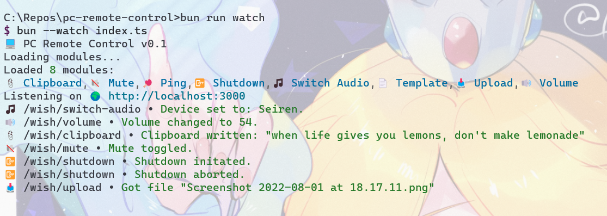

# pc-remote-control

A [Bun](https://bun.sh) server for remote control for your PC. Loosely based on my old [SiriFlask](https://github.com/Rosalina121/SiriFlask) project.  



## Quickstart

```bash
bun install
```

To run:

```bash
bun run start
```

## Config
`config.json` contains configuration for general app use (like files upload folder for Multer)  
Each Module may have it's own config for more specific use.

## Modules

Each functionality is split into modules in, well, `/modules`. It's just a TS class extending the `IModule`. All are loaded dynamically, so if you want to add something new, just create a new class and export the instance (or copy and adapt `Template.ts`).

A module has an `emoji`, `name`, `path` to be invoked on and `fn(request: moduleReq): IModuleResponse` performing a task. `IModuleResponse` is just a response string and a status code and `moduleReq` just an alias for the Express Request.

Some modules have an extra `.json` file named same as the module, which contains extra configs. These have to be created manually, as in most cases they include things like tokens, or personal stuff.

## In this repo

### Available modules

Following modules are available when you pull this repo:

-   Ping - just responds with "Pong!"
-   Mute - for now just runs a key combination
    -   TODO: mute the default recording device instead
-   Shutdown - performs a shutdown in 60s or after specified time
    -   Also you can reboot and abort the shutdown
-   Volume - changes volume to provided value
-   Clipboard - sets clipboard to provided string
-   Upload - saves uploaded file to folder
-   Switch Audio - switches to the audio device of provided name

### Dependencies

Some are cross-OS, some Win only. Here's the breakdown of deps that lean one way or another.

-   [NirCMD](https://www.nirsoft.net/utils/nircmd.html) - Windows only
    -   `Shutdown`, `Volume`, `Switch Audio`
